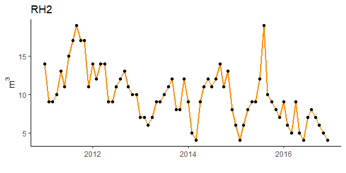
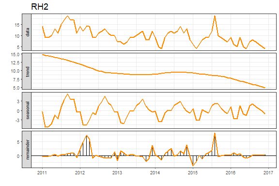
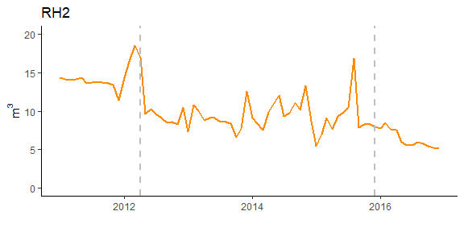
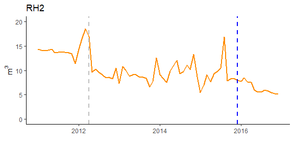

A strategy to assess water meter performance
================

## Overview

Functions, datasets and script used in the paper *A strategy to assess
water meter performance* by Clara Cordeiro, Ana Borges and M. Rosario
Ramos, in *Journal of Water Resources Planning and Management*, 2021.
Status: *under revision*.

### Install packages

``` r
install.packages("forecast",dependencies = TRUE)
install.packages("strucchange",dependencies = TRUE)
install.packages("trend",dependencies = TRUE)
```

### Usage

``` r
library(forecast)  
library(strucchange) 
library(trend) 
load("workspace_data_functions.RData")
```

### Functions implemented

-   **test.Outliers.STL**: *True* in case of outliers, otherwise *FALSE*

-   **T.dec**: *True* in case of a decreasing trend using Mann-Kendall
    test, otherwise *FALSE*

-   **s.bp**: find the relevant breakpoints

-   **RelMChange**: calculate the RMC (Eq. 5)

### Example - Residential household 2 (RH2)

``` r
y<-RH2
```



#### Initial settings

``` r
al<-0.05  # level of significance
s<-12   # define frequency
n.y<-length(y)  # time series length
k<-3  # its refers to the error measure used, in this case is Mean Absolute Error (MAE). However, it can be k<-1 for Mean Error (ME), k<-2 for Root Mean Square Error (RMSE), among others... see accuracy() function from package forecast for more information about it.
```

#### Step 1 - Seasonal-trend decomposition based on Loess

``` r
rob.y<-test.Outliers.STL(y) # check outliers
fit.y<-stl.fit(y,rob.y,k)  # stl.fit function
```



#### Step 2 - Detecting *breakpoints* (bp)

``` r
ystar<-y-fit.y$stlfit$time.series[,"seasonal"] # seasonally adjusted (y*)  (Eq.2)
min.h<-round(s/n.y,2) # max breaks (Eq. 3)
max.break<-ceiling(0.5/min.h) # min h (Eq. 4)
bpy<-breakpoints(ystar~1,h = min.h,breaks=max.break) # breakpoints() from package strucchange
```



#### Step 3 - Detecting *relevant breakpoints* (bp\*, blue dashed vertical line below)

``` r
bpy.star<-s.bp(ystar,bpy$breakpoints,al)
```



#### Step 4 - Determining *Relative Magnitude of Change* (RMC)

If bp\*=NULL then stop otherwise do the following

``` r
rmc<-RelMChange(ystar,bpy$breakpoints,bpy.star) (Eq. 5)
```

## Results

Table 1 and table 2, separated by double **\| \|**. See
*script\_tables.R*.

    ## [1] "Type | Breakpoints |  Segment 1  | Segment 2  | Segment 3  | | Relevant bp* | RMC "

    ## [1] "Rh2 | 2012(Apr),2015(Dec) | 0.01(0.89256) | -0.02(0.39474) | -0.26(2e-04) |  |  2015(Dec)  |  -12 |"

#### About software used

-   **R** version 4.1.0
-   package **trend** version 1.1.4
-   package **forecast** version 8.14
-   package **strucchange** version 1.5-2

#### *Contributions, issues, and feature requests are welcome!*
